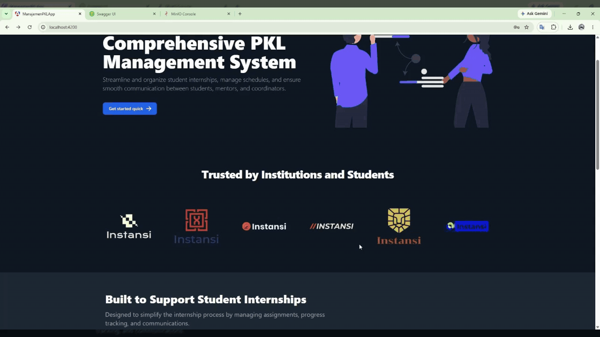
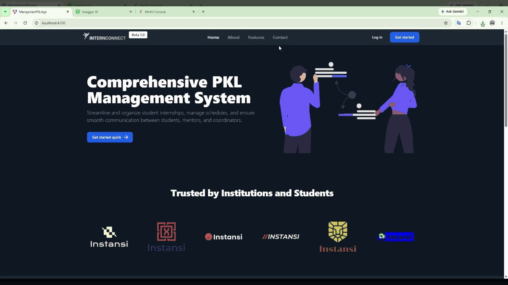
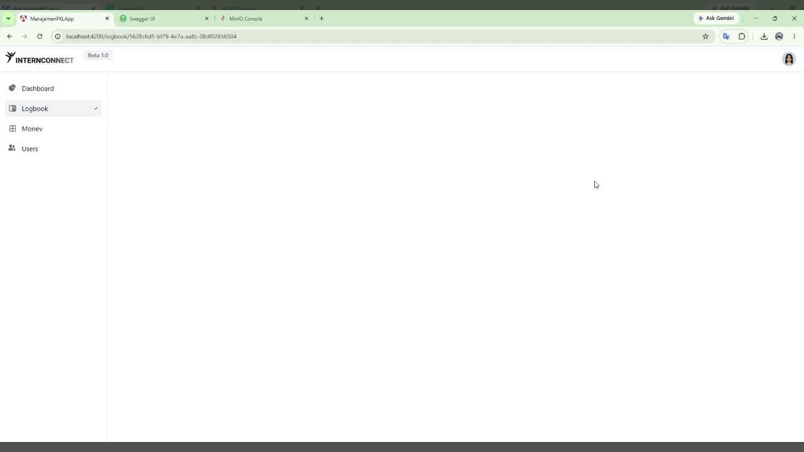

# Internconnect Frontend

Internconnect adalah aplikasi web untuk mendukung proses monitoring dan evaluasi kegiatan magang atau Praktik Kerja Lapangan. Aplikasi ini membantu mahasiswa, supervisor akademik, mentor industri, dan administrator dalam mengelola aktivitas magang dalam satu platform terintegrasi.

Frontend Internconnect dibangun menggunakan Angular dan berkomunikasi dengan backend ASP.NET Core melalui REST API.

<table>
  <tr>
    <td></td>
  </tr>
  <tr>
    <td></td>
  </tr>
  <tr>
    <td></td>
  </tr>
</table>

---

# About

Internconnect dikembangkan untuk mendigitalisasi proses monitoring kegiatan magang yang sebelumnya banyak dilakukan secara manual.

Sistem menyediakan fitur untuk mengelola logbook, aktivitas harian, proses verifikasi oleh supervisor atau mentor, pengajuan monitoring dan evaluasi, berbagi logbook kepada pengguna lain, pengelolaan profil, pengajuan perubahan role, serta online meeting.

Frontend menggunakan pendekatan **Feature-Based Architecture**. Struktur ini dipilih agar kode lebih mudah dikembangkan dan dipelihara dalam jangka panjang. Setiap fitur utama dipisahkan berdasarkan domain atau tanggung jawab bisnisnya, sehingga penambahan fitur baru tidak menyebabkan struktur aplikasi menjadi sulit dikelola.

---

# Features

## Authentication

Frontend terintegrasi dengan sistem authentication pada ASP.NET Core Backend.

Fitur yang tersedia:

* Register user
* Login
* Logout
* Mendapatkan informasi user yang sedang login
* Menyimpan dan menggunakan JWT untuk request terproteksi
* Role-based access control
* Route protection berdasarkan authentication dan role

Endpoint backend yang digunakan:

```text
POST /api/Account/register
POST /api/Account/login
GET  /api/Account/me
POST /api/Account/logout
POST /api/Account/assign-role
```

---

# User Management

Pengguna dapat mengelola informasi akun dan profil.

Fitur:

* Melihat informasi profil
* Membuat detail profil
* Mengubah detail profil
* Upload foto profil
* Mendapatkan foto profil
* Melihat detail user berdasarkan username
* Mengubah atau mengajukan perubahan role
* Mendapatkan daftar user berdasarkan role
* Download dokumen yang telah diupload

Endpoint backend:

```text
GET  /api/UserDetail
POST /api/UserDetail
PUT  /api/UserDetail

PUT  /api/UserDetail/upload-profile-picture
GET  /api/UserDetail/profile-picture-url
GET  /api/UserDetail/{username}

PUT  /api/User/update-role
GET  /api/User/by-role

GET  /api/UserDetail/download-file
```

---

# Logbook Management

Mahasiswa atau user dapat membuat dan mengelola logbook kegiatan magang.

Fitur:

* Membuat logbook
* Mengubah logbook
* Menghapus logbook
* Melihat seluruh logbook
* Melihat logbook milik sendiri
* Melihat detail logbook
* Melihat gambar yang diupload pada logbook

Endpoint backend:

```text
POST   /api/Logbook/create
PUT    /api/Logbook/update/{kodeLogbook}
DELETE /api/Logbook/delete/{kodeLogbook}

GET    /api/Logbook/all
GET    /api/Logbook/my-logbooks
GET    /api/Logbook/{kodeLogbook}
GET    /api/Logbook/image-url/{kodeLogbook}
```

Upload logbook menggunakan:

```text
multipart/form-data
```

File dan gambar yang dikirim dari frontend akan diproses oleh backend dan dapat disimpan pada MinIO Object Storage.

---

# Detail Logbook Management

Setiap logbook dapat memiliki beberapa aktivitas atau detail kegiatan.

Fitur:

* Membuat aktivitas
* Melihat detail aktivitas
* Melihat seluruh aktivitas dalam logbook
* Mengubah aktivitas
* Menghapus aktivitas
* Verifikasi aktivitas

Endpoint backend:

```text
POST   /api/DetailLogbook/{kodeLogbook}/create
GET    /api/DetailLogbook/{id}
GET    /api/DetailLogbook/{kodeLogbook}/all

PUT    /api/DetailLogbook/{id}/update
DELETE /api/DetailLogbook/{id}/delete

PUT    /api/DetailLogbook/{id}/verif
```

Proses verifikasi dapat digunakan oleh role yang memiliki hak akses seperti Supervisor atau Mentor.

---

# Shared Logbook

User dapat membagikan logbook kepada pengguna lain.

Fitur:

* Membagikan logbook
* Mengatur permission
* Mengubah permission
* Menghapus akses user
* Melihat daftar user yang memiliki akses

Endpoint backend:

```text
POST   /api/Shared/{kodeLogbook}/create
PUT    /api/Shared/{kodeLogbook}/update/{id}
DELETE /api/Shared/{kodeLogbook}/delete/{id}

GET    /api/Shared/{kodeLogbook}/all
```

Fitur ini memungkinkan supervisor atau mentor melihat logbook mahasiswa yang telah memberikan akses.

---

# Monitoring and Evaluation

Sistem mendukung proses monitoring dan evaluasi kegiatan magang.

Fitur:

* Mengajukan monitoring dan evaluasi
* Melihat data monitoring berdasarkan logbook

Endpoint backend:

```text
POST /api/Monev/ajukan-monev
GET  /api/Monev/{kodeLogbook}
```

---

# Online Meeting

Internconnect mendukung online meeting menggunakan integrasi Whereby API melalui backend.

Alur integrasi:

```text
Angular Frontend
       |
       | HTTP Request
       v
ASP.NET Core Backend
       |
       | API Request
       v
Whereby API
       |
       v
Online Meeting Room
```

Frontend tidak berkomunikasi langsung dengan Whereby API. Request dilakukan melalui ASP.NET Core Backend agar API key Whereby tetap aman dan tidak terekspos di browser.

Frontend bertanggung jawab untuk:

* Menampilkan informasi meeting
* Menampilkan link meeting
* Menampilkan jadwal meeting
* Mengarahkan user untuk bergabung ke meeting

Backend bertanggung jawab untuk:

* Berkomunikasi dengan Whereby API
* Menyimpan API key
* Membuat meeting room
* Mengembalikan informasi meeting kepada frontend

---

# User Roles

Internconnect memiliki beberapa role pengguna.

## User

Role utama untuk pengguna yang melakukan kegiatan magang.

Kemampuan utama:

* Membuat logbook
* Mengelola aktivitas logbook
* Mengupload dokumen dan gambar
* Membagikan logbook
* Mengajukan monitoring dan evaluasi
* Mengubah informasi profil
* Mengajukan perubahan role

## Supervisor

Supervisor dapat melakukan monitoring terhadap aktivitas user.

Kemampuan utama:

* Melihat logbook yang telah dibagikan
* Melihat aktivitas logbook
* Melakukan verifikasi aktivitas
* Melakukan monitoring
* Berpartisipasi dalam meeting

## Mentor

Mentor dapat membantu proses monitoring kegiatan magang.

Kemampuan utama:

* Melihat logbook yang diberikan akses
* Melihat aktivitas
* Melakukan verifikasi
* Berpartisipasi dalam proses evaluasi

## Admin

Administrator memiliki akses terhadap manajemen sistem tertentu.

Kemampuan utama:

* Mengakses data administrator
* Mengelola role user sesuai authorization backend

---

# Frontend Architecture

Frontend menggunakan **Feature-Based Architecture**.

Pendekatan ini memisahkan kode berdasarkan fitur bisnis dibandingkan hanya berdasarkan jenis file.

Contoh struktur:

```text
src/
│
├── app/
│
│   ├── core/
│   │   │
│   │   ├── guards/
│   │   │   ├── auth.guard.ts
│   │   │   └── role.guard.ts
│   │   │
│   │   ├── interceptors/
│   │   │   └── auth.interceptor.ts
│   │   │
│   │   ├── services/
│   │   │   ├── auth.service.ts
│   │   │   ├── api.service.ts
│   │   │   └── storage.service.ts
│   │   │
│   │   └── models/
│   │
│   ├── features/
│   │
│   │   ├── auth/
│   │   │   ├── pages/
│   │   │   │   ├── login/
│   │   │   │   ├── register/
│   │   │   │   └── forgot-password/
│   │   │   │
│   │   │   ├── services/
│   │   │   └── models/
│   │   │
│   │   ├── dashboard/
│   │   │   ├── pages/
│   │   │   └── components/
│   │   │
│   │   ├── logbook/
│   │   │   ├── pages/
│   │   │   ├── components/
│   │   │   ├── services/
│   │   │   └── models/
│   │   │
│   │   ├── detail-logbook/
│   │   │   ├── pages/
│   │   │   ├── components/
│   │   │   ├── services/
│   │   │   └── models/
│   │   │
│   │   ├── shared/
│   │   │   ├── pages/
│   │   │   ├── components/
│   │   │   └── services/
│   │   │
│   │   ├── monev/
│   │   │   ├── pages/
│   │   │   ├── components/
│   │   │   └── services/
│   │   │
│   │   ├── meeting/
│   │   │   ├── pages/
│   │   │   ├── components/
│   │   │   └── services/
│   │   │
│   │   ├── profile/
│   │   │   ├── pages/
│   │   │   ├── components/
│   │   │   └── services/
│   │   │
│   │   └── user-management/
│   │       ├── pages/
│   │       ├── components/
│   │       ├── services/
│   │       └── models/
│   │
│   ├── shared/
│   │   │
│   │   ├── components/
│   │   │   ├── modal/
│   │   │   ├── navbar/
│   │   │   ├── sidebar/
│   │   │   └── loading/
│   │   │
│   │   ├── directives/
│   │   │
│   │   └── pipes/
│   │
│   ├── layouts/
│   │   ├── main-layout/
│   │   └── auth-layout/
│   │
│   ├── app.routes.ts
│   ├── app.config.ts
│   └── app.component.ts
│
├── assets/
│   └── images/
│
└── environments/
    ├── environment.ts
    └── environment.development.ts
```

---

# Why Feature-Based Architecture?

Struktur Feature-Based Architecture digunakan karena aplikasi Internconnect memiliki beberapa domain utama yang berbeda, seperti authentication, logbook, monitoring, profile, sharing, dan meeting.

Dengan struktur ini:

* Setiap fitur memiliki kode yang terorganisir
* Perubahan pada satu fitur tidak terlalu memengaruhi fitur lain
* Lebih mudah menemukan file terkait sebuah fitur
* Service dan model dapat dikelompokkan berdasarkan domain
* Memudahkan pengembangan fitur baru
* Memudahkan maintenance jangka panjang
* Lebih mudah digunakan ketika jumlah developer bertambah
* Struktur aplikasi lebih scalable

Contoh ketika ingin mengembangkan fitur logbook, developer dapat fokus pada:

```text
features/logbook/
```

tanpa perlu mencari file pada banyak folder global yang berbeda.

---

# Shared Components

Komponen yang digunakan oleh beberapa fitur ditempatkan pada:

```text
shared/
```

Contoh:

```text
shared/
├── components/
│   ├── modal/
│   ├── navbar/
│   ├── sidebar/
│   ├── pagination/
│   ├── loading/
│   └── empty-state/
│
├── directives/
│
└── pipes/
```

Komponen pada folder `shared` sebaiknya bersifat reusable dan tidak memiliki business logic yang terlalu spesifik terhadap satu fitur.

Contoh:

* Modal
* Navbar
* Sidebar
* Pagination
* Loading state
* Empty state
* Confirmation dialog

---

# Core Layer

Folder `core` digunakan untuk kode yang bersifat global dan digunakan oleh seluruh aplikasi.

Contoh:

```text
core/
├── guards/
├── interceptors/
├── services/
└── models/
```

## Guards

Digunakan untuk mengatur akses route.

Contoh:

```text
auth.guard.ts
role.guard.ts
```

Fungsinya:

* Mencegah user yang belum login mengakses halaman tertentu
* Membatasi halaman berdasarkan role

---

## HTTP Interceptor

JWT token dapat ditambahkan secara otomatis pada request API menggunakan interceptor.

Contoh konsep:

```text
Frontend Request
       |
       v
Auth Interceptor
       |
       | Tambahkan Authorization Header
       v
ASP.NET Core API
```

Header:

```http
Authorization: Bearer JWT_TOKEN
```

Dengan pendekatan ini, setiap service tidak perlu menambahkan token secara manual.

---

# Backend Integration

Frontend terhubung dengan backend ASP.NET Core menggunakan REST API.

Contoh Base URL development:

```text
http://localhost:5244
```

Endpoint backend dapat dikelompokkan berdasarkan domain:

```text
/api/Account
/api/Admin
/api/Dosen
/api/DetailLogbook
/api/Logbook
/api/Monev
/api/Shared
/api/User
/api/UserDetail
```

Base URL sebaiknya disimpan pada environment configuration.

Contoh:

```typescript
export const environment = {
  production: false,
  apiUrl: 'http://localhost:5244'
};
```

Service kemudian menggunakan:

```text
environment.apiUrl
```

Hal ini memudahkan perubahan URL ketika berpindah dari development ke production.

---

# JWT Integration

Alur authentication pada frontend:

```text
User
  |
  v
Login Page
  |
  v
Auth Service
  |
  | POST /api/Account/login
  v
ASP.NET Core Backend
  |
  v
JWT Token
  |
  v
Frontend Storage
  |
  v
HTTP Interceptor
  |
  v
Protected API
```

Frontend menggunakan JWT untuk:

* Mengidentifikasi user yang sedang login
* Mengakses endpoint terproteksi
* Menentukan halaman yang dapat diakses
* Menampilkan menu berdasarkan role
* Mengamankan navigation menggunakan guard

Detail implementasi penyimpanan token perlu disesuaikan dengan mekanisme authentication yang digunakan backend.

---

# File and Image Handling

Frontend menggunakan `FormData` ketika mengirim file ke backend.

Contoh penggunaan:

```typescript
const formData = new FormData();

formData.append('Content', content);
formData.append('DateStart', dateStart);
formData.append('DateEnd', dateEnd);
formData.append('Status', status);
formData.append('Deskripsi', description);

if (image) {
  formData.append('Image', image);
}
```

Alur penyimpanan:

```text
Angular Frontend
       |
       | multipart/form-data
       v
ASP.NET Core Backend
       |
       v
MinIO
       |
       v
Object Storage
```

Frontend tidak perlu memiliki credential MinIO.

Credential MinIO hanya digunakan oleh backend.

---

# Tech Stack

| Category           | Technology                 |
| ------------------ | -------------------------- |
| Frontend Framework | Angular                    |
| Language           | TypeScript                 |
| Styling            | Tailwind CSS               |
| Backend            | ASP.NET Core Web API       |
| Database           | Microsoft SQL Server       |
| ORM                | Entity Framework Core      |
| Object Storage     | MinIO                      |
| Authentication     | JWT                        |
| Online Meeting     | Whereby API                |
| API Documentation  | Swagger / OpenAPI          |
| Architecture       | Feature-Based Architecture |
| Containerization   | Docker                     |

---

# Screenshots

<table>
  <tr>
    <th>Image 1</th>
    <th>Image 2</th>
  </tr>

  <tr>
    <td>
      
    </td>
    <td>
      
    </td>
  </tr>

  <tr>
    <td>
      
    </td>
    <td>
      
    </td>
  </tr>

  <tr>
    <td>
      
    </td>
    <td>
      
    </td>
  </tr>

  <tr>
    <td>
      
    </td>
    <td>
      
    </td>
  </tr>

  <tr>
    <td>
      
    </td>
    <td>
      
    </td>
  </tr>

  <tr>
    <td>
      
    </td>
    <td>
      
    </td>
  </tr>

  <tr>
    <td>
      
    </td>
    <td>
      
    </td>
  </tr>

  <tr>
    <td>
      
    </td>
    <td>
      
    </td>
  </tr>
</table>

---

# Wireframe Design

Wireframe aplikasi dirancang menggunakan Figma.

[View Internconnect Wireframe Design](https://www.figma.com/design/US463LePI2srCstqkU6vyq/Internconnect-wireframe?t=pgyQCqzZM0rdwQ2z-0&utm_source=chatgpt.com)

---

# Challenges

Pengembangan Internconnect memiliki beberapa tantangan utama:

* Mengubah proses monitoring magang manual menjadi sistem digital.
* Mengelola beberapa role dengan hak akses yang berbeda.
* Mendesain alur verifikasi antara mahasiswa, supervisor, dan mentor.
* Mengelola data logbook dan aktivitas yang saling berhubungan.
* Mengatur akses logbook yang dibagikan kepada pengguna lain.
* Mengelola upload gambar dan dokumen.
* Mengintegrasikan JWT authentication dengan Angular.
* Mengintegrasikan online meeting melalui backend.
* Menjaga struktur frontend agar tetap mudah dikelola ketika jumlah fitur bertambah.

---

# Solutions

Untuk mengatasi tantangan tersebut, Internconnect menggunakan beberapa pendekatan:

* Feature-Based Architecture untuk memisahkan domain aplikasi.
* Angular services untuk komunikasi dengan REST API.
* HTTP interceptor untuk menangani JWT.
* Route guards untuk melindungi halaman.
* Role-based navigation untuk menyesuaikan menu pengguna.
* Reusable components untuk komponen yang digunakan berulang.
* Backend integration sebagai perantara ke MinIO dan Whereby.
* Environment configuration untuk memisahkan konfigurasi development dan production.

Dengan pendekatan tersebut, setiap bagian aplikasi dapat dikembangkan secara lebih terstruktur tanpa terlalu bergantung pada fitur lain.

---

# What I Learned

Melalui pengembangan project ini, saya mendapatkan pengalaman dalam:

* Angular application development
* TypeScript
* Feature-Based Architecture
* Component-based development
* REST API integration
* ASP.NET Core Web API integration
* JWT authentication dan authorization
* Role-Based Access Control
* HTTP Interceptor
* Route Guard
* File upload menggunakan FormData
* Integrasi MinIO melalui backend
* Integrasi online meeting menggunakan Whereby API
* Microsoft SQL Server
* Enterprise web application architecture
* Software maintainability
* Team collaboration dalam pengembangan software

---

# Future Improvements

Beberapa pengembangan yang dapat dilakukan selanjutnya:

* Push notification
* Email notification
* Real-time notification
* Real-time chat
* Calendar synchronization
* Meeting history
* Document review workflow
* Attendance tracking
* Analytics dashboard
* Mobile application
* Multi-university support
* AI-assisted internship progress analysis
* Audit log untuk aktivitas penting
* Dashboard khusus berdasarkan role

---

# Project Documentation

Backend documentation tersedia pada repository:

[Internconnect Backend](https://github.com/wedawesnawa/internconnect-backend?utm_source=chatgpt.com)

Backend menggunakan:

* ASP.NET Core
* Microsoft SQL Server
* Entity Framework Core
* Docker
* MinIO
* JWT Authentication
* Whereby API
* Swagger / OpenAPI

---

# Publication

Project ini telah dipublikasikan pada Jurnal JUPITA Universitas Udayana.

## Publication

[Penerapan Sistem Berbasis Web untuk Meningkatkan Efektivitas Monitoring dan Evaluasi Praktek Kerja Lapangan di PT. Sanata System](https://ejournal1.unud.ac.id/index.php/jupita/article/view/1759?utm_source=chatgpt.com)
